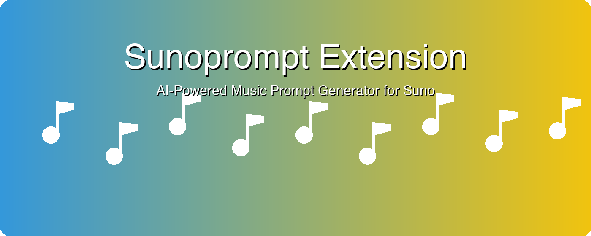

# Sunoprompt Chrome拡張機能

Suno AI用の高品質な音楽プロンプトを生成するChrome拡張機能。高度なテーマ選択とジャンル分類機能を搭載。

## 機能

- 🎨 **テーマ選択**: 90種類以上の定義済みテーマから選択、またはカスタムテーマ作成
- 🎸 **ジャンル選択**: 150種類以上のジャンルから最大3つまで選択可能
- 🎵 **音楽設定**: BPM、音楽キー、言語比率の詳細設定
- 🎤 **パート設定**: 各楽曲パートごとの詳細設定
- 🔑 **APIキー管理**: OpenAI APIキーの安全な保存
- 💾 **データ保存**: 入力設定の自動保存・復元
- 🎯 **デバッグモード**: Ctrl+Shift+Dで詳細表示

## スクリーンショット



## インストール

### Chrome Web Storeから
*準備中 - Chrome Web Storeで公開予定*

### 手動インストール（開発者モード）

1. このリポジトリをダウンロードまたはクローン
2. Chromeを開き `chrome://extensions/` に移動
3. 右上の「デベロッパーモード」を有効化
4. 「パッケージ化されていない拡張機能を読み込む」をクリックし `extension` フォルダを選択
5. 拡張機能がChromeツールバーに表示されます

## セットアップ

### APIキーの設定
1. [OpenAI Platform](https://platform.openai.com/)からOpenAI APIキーを取得
2. Chromeで拡張機能アイコンをクリック
3. 設定画面でAPIキーを入力
4. 「保存」をクリックして安全に保存

### 基本的な使い方
1. **テーマ選択**: プリセットテーマから選択、またはカスタムテーマを入力
2. **ジャンル選択**: ドロップダウンから最大3つのジャンルを選択
3. **音楽設定**: BPM、キー、言語設定を調整
4. **パート設定**: イントロ、バース、コーラス、ブリッジ、アウトロを設定
5. **生成**: 「プロンプト生成」をクリックして音楽プロンプトを作成
6. **コピー**: 生成されたプロンプトをSuno AIで使用

## 技術詳細

### 使用技術
- **Manifest V3**: 最新のChrome拡張機能標準
- **OpenAI API**: インテリジェントなプロンプト生成にGPT-4を使用
- **Chrome Storage API**: 安全なローカルデータ永続化
- **Vanilla JavaScript**: 外部依存関係なし

### アーキテクチャ
```
extension/
├── manifest.json          # 拡張機能設定
├── popup.html            # メインUI
├── popup.js              # コアロジック
├── background.js         # バックグラウンドサービスワーカー
├── styles-scoped.css     # スコープ付きスタイル
├── theme-presets.js      # テーマ定義
├── genres.js             # ジャンルカテゴリ
├── musical-keys.js       # 音楽キーデータ
├── instruments.js        # 楽器定義
└── icons/                # 拡張機能アイコン
```

### 権限
- `storage`: 設定と環境設定の保存
- `https://api.openai.com/*`: OpenAI APIへの接続

## 開発

### 前提条件
- Chromeブラウザ
- OpenAI APIキー
- テキストエディタまたはIDE

### ローカル開発
1. リポジトリをクローン:
   ```bash
   git clone https://github.com/usedhonda/sunoprompt.git
   cd sunoprompt
   ```

2. Chromeで拡張機能を読み込み:
   - `chrome://extensions/` を開く
   - デベロッパーモードを有効化
   - 「パッケージ化されていない拡張機能を読み込む」をクリック
   - `extension` フォルダを選択

3. 変更を加えて拡張機能をリロードしてテスト

### デバッグモード
拡張機能ポップアップで `Ctrl+Shift+D` を押すと、詳細ログと高度なオプションを含むデバッグモードが有効になります。

## 貢献

1. リポジトリをフォーク
2. 機能ブランチを作成 (`git checkout -b feature/amazing-feature`)
3. 変更をコミット (`git commit -m 'Add some amazing feature'`)
4. ブランチにプッシュ (`git push origin feature/amazing-feature`)
5. プルリクエストを開く

## プライバシーとセキュリティ

- APIキーはChromeの安全なストレージを使用してローカルに保存
- OpenAI API以外のサードパーティにデータを送信しません
- すべての処理はブラウザ内でローカルに実行
- 詳細については[プライバシーポリシー](extension/privacy-policy.html)を参照

## ライセンス

このプロジェクトはMITライセンスの下でライセンスされています - 詳細については[LICENSE](LICENSE)ファイルを参照してください。

## サポート

問題が発生したり質問がある場合:

1. [トラブルシューティングセクション](extension/README.md#troubleshooting)を確認
2. GitHubでIssueを開く
3. OpenAI APIキーが有効で十分なクレジットがあることを確認

## バージョン履歴

### v1.1.1 (2025-01-18)
#### 🔧 Critical Prompt Fixes
- **言語比率指示の大幅強化**: 英語8割指定でも日本語が半分になる問題を修正
- **厳密な言語比率遵守**: 指定比率からの逸脱を禁止する強力な指示を追加
- **複数箇所での比率強調**: SystemPrompt、UserPrompt、Lyricsセクションで一貫した指示

### v1.1.0 (2025-01-18)
#### ✨ Major Features
- **完全な状態復元機能**: カスタムテーマのテキスト、フォーカス位置、カーソル位置、スクロール位置を完全復元
- **リアルタイム自動保存**: デバウンス機能付きでユーザー入力を即座に保存
- **フォーカス状態管理**: テキストエリアのカーソル位置まで正確に復元
- **強化されたフォーム永続化**: タイムスタンプ付きで状態管理を改善

#### 🔧 Technical Improvements
- フォーカス変更時の自動保存機能
- キーボード入力による保存トリガー強化
- 詳細なログ出力でデバッグ性向上

### v1.0.9 (2025-01-18)
#### 🐛 Bug Fixes
- **ポップアップ予期しない閉じ問題対策**: 出力後のウィンドウ突然消失を防ぐ安定性機能を追加
- **エラーハンドリング強化**: displayResults関数のエラー処理を改善
- **デバッグ機能強化**: ポップアップの状態監視とハートビート機能を追加
- 未処理のPromise拒否やJavaScriptエラーによるクラッシュを防止

### v1.0.8 (2025-01-18)
#### 🔧 Critical Prompt Improvements
- **ひらがな変換指示の大幅強化**: SystemPromptで「絶対遵守事項」として明記
- **漢字・数字変換の徹底指示**: 🚨マークと具体例で視覚的に強調
- **チェックリスト形式の追加**: Lyricsセクションで変換ルールを明確化
- Suno AI音声合成の精度向上のための必須対応を強制化

### v1.0.7 (2025-01-18)
#### 🐛 Bug Fixes
- **Extension context invalidated エラー改善**: 拡張機能コンテキスト無効化時のエラーハンドリングを強化
- フォームデータ保存失敗時のユーザーフレンドリーなメッセージ表示
- 頻繁なエラー表示を防ぐための警告表示制御機能を追加

### v1.0.6 (2025-01-18)
#### 🔧 Prompt Improvements
- **キー情報の強制指示**: BPM・Keyの省略を防ぐため「絶対に省略しないでください」指示を追加
- **ひらがな変換指示の改善**: 漢字・数字のみをひらがな化し、カタカナはそのまま保持するよう修正

### v1.0.5 (2025-01-18)
#### 🐛 Bug Fixes
- ジャンルカテゴリーの起動時自動展開機能を修正
- ジャンルボタンの選択状態視覚フィードバック（ピンク表示）を修正
- `data-category-id`属性の欠落によるカテゴリー展開エラーを解決

#### 📦 Distribution
- Chrome Web Store配布用パッケージを作成（`dist/sunoprompt-extension-v1.0.5-chrome-web-store.zip`）

### v1.0.4 (2025-01-18)
#### ✨ New Features
- ホバーツールチップ機能を全フォームラベルに追加
- 日本語歌詞の自動ひらがな化指示を追加（Suno音声合成精度向上）

#### 🐛 Bug Fixes  
- Extension context invalidatedエラーの改善とユーザーフレンドリーなメッセージ表示

#### 🎨 UI/UX Improvements
- ラベルにピンクボーダーデザイン適用
- キーワードフィールドの名称と説明文を改善（「歌詞に含めたい言葉（参考）」）
- ラベルホバー時のアニメーション効果追加

### v1.0.3 (2025-01-18)
#### 🔧 Internal Improvements
- プロジェクト構造の整理とドキュメント改善
- 国際化実装の失敗コードを完全クリーンアップ

### v1.0.2 (2025-01-18)  
#### 🎨 UI/UX Improvements
- 右クリックメニューとページオーバーレイ機能の復旧
- コンテンツスクリプト注入の最適化

### v1.0.1 (2025-01-18)
#### 📚 Documentation
- プロジェクト設定ファイル（CLAUDE.md、.gitignore）の追加
- 開発ガイドラインとコーディング規約の整備

### v1.0.0 (2025-01-17)
#### 🎉 Initial Release
- テーマとジャンル選択機能
- OpenAI API統合
- Chrome Storage実装  
- デバッグモードサポート
- 90+テーマプリセット
- 150+ジャンルカテゴリ
- BPM、キー、言語比率設定
- パート別詳細構成機能

---

Made with ❤️ for music creators using Suno AI